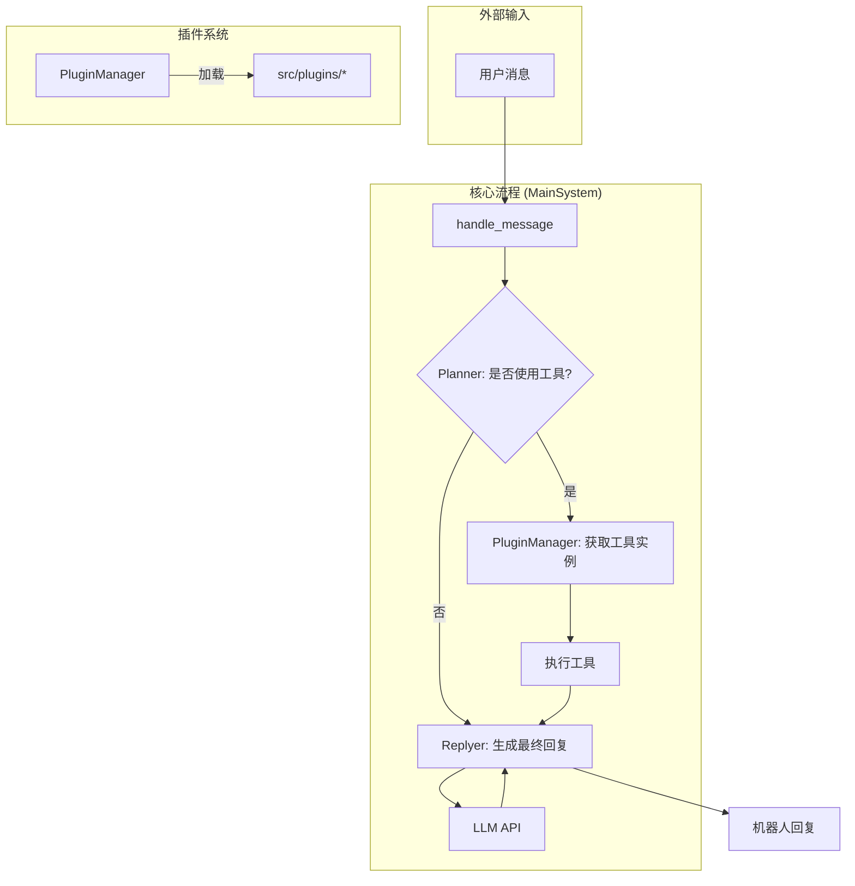

# Shiraha_bot 开发文档

欢迎来到 Shiraha_bot 项目！本篇文档旨在帮助新开发者快速了解项目架构、上手开发、并进行功能拓展。

## 1. 快速上手

本章节将指导你完成项目的环境配置和首次运行。

### 1.1. 环境要求

- **Python**: `3.10` 或更高版本
- **pip**: 用于管理 Python 包

### 1.2. 安装步骤

1.  **克隆项目**
    ```bash
    git clone <your-repository-url>
    cd Shiraha_bot
    ```

2.  **创建虚拟环境 (推荐)**
    ```bash
    python -m venv venv
    venv\Scripts\activate
    ```

3.  **安装依赖**
    项目所需的全部依赖都记录在 `requirements.txt` 文件中。运行以下命令进行安装：
    ```bash
    pip install -r requirements.txt
    ```
4.  **股票分析模型配置**
    股票模型请放入`src/plugins/utils/`文件夹，命名为`policy_final.pt`

5.  **配置LLM**
    请按照 `3. LLM 模型配置`完成配置
    
### 1.3. 运行项目

本项目提供了两种运行模式：

1.  **命令行测试模式 (`test.py`)**:
    这是一个简单的交互式命令行，用于快速测试机器人的回复逻辑。
    ```bash
    python test.py
    ```

2.  **Web 服务模式 (`main.py`)**:
    这将启动一个基于 FastAPI 的 WebSocket 服务，用于和前端界面对接。
    ```bash
    python main.py
    ```
    服务启动后，你可以访问 `http://localhost:8000`，会看到一个简单的测试页面，你可以在其中与机器人进行实时聊天。

---

## 2. 项目架构

项目采用分层、插件化的架构，核心组件各司其职，易于扩展。

### 2.1. 核心组件

-   **`MainSystem` (`src/core/bot.py`)**: 系统的总指挥。它接收外部消息，并协调 `PluginManager`、`Planner` 和 `Replyer` 等组件完成一次完整的“思考->回复”流程。
-   **`PluginManager` (`src/plugin_system/manager.py`)**: 插件管理器。负责在程序启动时，自动扫描 `src/plugins` 目录，加载所有合法的插件及其包含的工具。
-   **`Planner` (`src/plugin_system/plugin_planner.py`)**: 规划器。这是机器人的“短期决策脑”，负责两件事：
    1.  **是否回复**：根据消息内容判断机器人是否应该响应。
    2.  **使用何种工具**：如果需要回复，它会决定调用哪些插件工具来获取额外信息。
-   **`Replyer` (`src/core/replyer.py`)**: 回复生成器。这是机器人的“语言组织脑”，它接收用户原始问题、`Planner` 调用工具返回的结果以及其他上下文信息，然后填充主 `Prompt` 模板，最终调用 LLM 生成自然、流畅的回复。

### 2.2. 架构交互图 (Mermaid)



---

## 3. LLM 模型配置

配置大语言模型（LLM）是启动本项目的关键一步。

### 3.1. 当前配置方式
请在根目录新建.env文件
#### 模板：
```
DEEPSEEK_API_KEY="你的key"
DEEPSEEK_BASE_URL="https://api.siliconflow.cn/v1/"
DEEPSEEK_MODEL_NAME="Pro/deepseek-ai/DeepSeek-V3"
```
---

## 4. Prompt 修改指引

项目中所有用于生成回复的核心 Prompt 都集中管理。

-   **文件位置**: `src/core/prompts.py`
-   **核心模板**: `REPLYER_PROMPT`

`REPLYER_PROMPT` 是一个巨大的格式化字符串，它由多个 `{}` 占位符组成。`Replyer` 组件的工作就是用各种上下文信息去填充这些占位符，最后形成一个完整的、发送给 LLM 的最终指令。如果你想调整机器人的**核心行为、身份设定或回复风格**，修改这个文件中的模板是最高效的方式。

---

## 5. 插件开发指南

插件是 `Shiraha_bot` 功能扩展的核心。通过开发插件，你可以让机器人拥有调用外部 API、查询数据库、执行计算等各种能力。

### 5.1. 核心概念

-   **`BaseTool` (`src/plugin_system/base.py`)**: “工具”的基类。一个工具代表一个具体的能力。
-   **`BasePlugin` (`src/plugin_system/base.py`)**: “插件”的基类。一个插件是多个相关 `Tool` 的集合。

### 5.2. 开发步骤

#### 第 1 步：创建插件文件

在 `src/plugins/` 目录下创建一个新的 Python 文件，例如 `hello_world_plugin.py`。

#### 第 2 步：编写插件代码

打开你刚创建的文件，粘贴并修改以下模板：

```python
# src/plugins/hello_world_plugin.py

from typing import List, Dict, Any, Type
from src.plugin_system.base import BasePlugin, BaseTool

class HelloWorldTool(BaseTool):
    name = "say_hello"
    description = "当用户想要打招呼时，使用此工具。"
    parameters = [
        {
            "name": "target_name",
            "type": "string",
            "description": "要问候的人的名字",
            "required": True
        }
    ]

    async def execute(self, target_name: str) -> Dict[str, Any]:
        greeting = f"你好，{target_name}！很高兴认识你。"
        return {"greeting_message": greeting}

class HelloWorldPlugin(BasePlugin):
    def get_tools(self) -> List[Type[BaseTool]]:
        return [HelloWorldTool]
```

#### 第 3 步：完成！

`PluginManager` 会在下次程序启动时自动发现并加载你的新插件。

---

## 6. `invest` 插件功能与改造

### 6.1. 当前功能

-   **工具名称**: `invest_analysis`
-   **功能**: 它会自动从 `data/invest_data/` 目录加载一个 `.json` 文件，然后使用本地模型进行分析，并生成投资建议。
-   **输入**: 无。数据来源是硬编码的本地文件。

### 6.2. 改造指导：从本地文件到前端输入

#### 第 1 步：修改 `invest_plugin.py` (后端)

修改 `InvestAnalysisTool` 类，使其接收一个名为 `ohlcv_json` 的字符串参数，并解析这个字符串，而不是读取文件。

```python
# src/plugins/invest_plugin.py (修改后)
import json
import pandas as pd
# ...
class InvestAnalysisTool(BaseTool):
    name = "invest_analysis"
    description = "根据用户提供的股票历史数据JSON字符串，生成投资分析建议。"
    parameters = [
        {
            "name": "ohlcv_json",
            "type": "string",
            "description": "一个包含OHLCV时间序列数据的JSON格式字符串。",
            "required": True
        }
    ]

    async def execute(self, ohlcv_json: str) -> Dict[str, Any]:
        try:
            rows = json.loads(ohlcv_json)
            df = pd.DataFrame(rows)
        except Exception as e:
            return {"error": f"JSON数据解析失败: {e}"}
        
        # ... 后续的数据校验和模型调用逻辑保持不变 ...
        return {"result": "分析结果..."}
```

#### 第 2 步：修改 `main.py` (前端)

在测试页面上加一个 `<textarea>`，并约定一个命令格式 (如 `invest:: <json_string>`) 来发送数据。

```python
# main.py (HTML部分修改)
html = """
...
        <h2>投资分析 (输入OHLCV JSON)</h2>
        <p>在这里粘贴JSON数据，然后点击下面的按钮。会以 "invest:: [你的JSON]" 格式发送。</p>
        <textarea id="jsonInput" rows="10" cols="60"></textarea><br>
        <button onclick="sendInvestData()">Send Investment Data</button>
...
        <script>
            ...
            function sendInvestData() {
                var jsonInput = document.getElementById("jsonInput");
                var payload = "invest:: " + jsonInput.value;
                ws.send(payload);
            }
        </script>
...
"""
```
**注意**: 你可能需要增强 `Planner` 的逻辑，使其能识别 `invest::` 命令，并将后续内容作为参数传递给 `invest_analysis` 工具。
