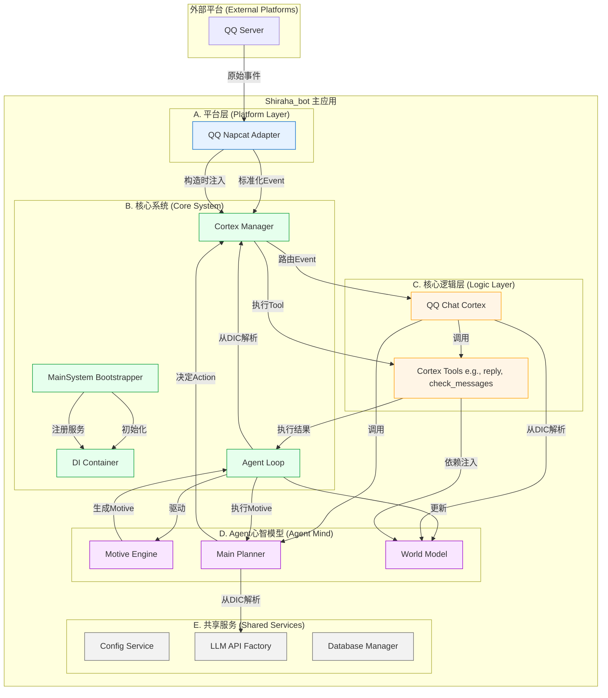

# Shiraha_bot 设计文档

本文档旨在分析和阐述 `Shiraha_bot` 项目的系统架构、核心工作流和主要特性。

## 1. 项目特性 (Features)

- **多平台支持 (Multi-Platform)**: 通过可插拔的 `PlatformAdapter` 适配器模式，系统可以轻松扩展以支持不同的聊天平台（如已实现的 QQ Napcat）。
- **高度模块化 (Highly Modular)**: 系统被分解为多个独立的、功能内聚的模块（`Platform`, `Cortex`, `Agent`, `LLM`, `Plugin`），通过依赖注入（DI）容器解耦。
- **自主智能体 (Autonomous Agent)**: 项目实现了一个 `AgentLoop`，使其不仅仅是一个被动的聊天机器人。该 Agent 拥有自己的“心跳”，能够基于内部动机（Motive）和世界模型（World Model）自主地进行“感知-思考-行动”，执行主动任务。
- **可扩展的能力单元 (Extensible Capabilities)**: 核心逻辑被封装在 `Cortex`（皮层）中。每个 `Cortex` 都是一个功能单元，可以动态加载并提供一系列 `Tool`（工具），供 Agent 或其他部分调用。
- **依赖注入 (Dependency Injection)**: 项目内置一个简单的 DI 容器，用于管理所有核心服务的生命周期和依赖关系，显著提高了代码的可测试性和可维护性。
- **事件驱动 (Event-Driven)**: 平台适配器将外部事件（如消息、好友请求）标准化为内部 `Event` 对象，由系统核心进行处理，实现了外部平台与内部逻辑的隔离。
- **配置驱动 (Configuration-Driven)**: 核心行为和连接信息（如机器人人格、API密钥）都通过 `.toml` 配置文件进行管理，易于部署和修改。

## 2. 系统架构 (System Architecture)

系统可以看作由一个**中央协调核心**和多个**专业服务模块**组成。

### 组件职责

- **MainSystem**: 应用的启动器，负责读取配置、初始化所有核心服务，并将它们注册到 DI 容器中。
- **DI Container**: 一个全局单例容器，存放所有核心服务的实例，供其他模块按需解析使用。
- **Platform Layer**:
  - **`BasePlatformAdapter`**: 定义了所有平台适配器的通用接口（`run`, `terminate`）。
  - **具体适配器 (e.g., `qq_napcat/adapter.py`)**: 负责与特定平台（如QQ）进行通信，将平台事件转换为标准 `Event` 对象，并发送给核心系统。同时，它也接收来自核心系统的指令来在平台上执行操作（如发送消息）。
- **Cortex Manager**:
  - 管理所有 `Cortex` 模块的生命周期（加载、卸载）。
  - 接收来自平台适配器的 `Event`，并将其路由到合适的 `Cortex` 进行处理。
  - 提供 `execute_tool` 方法，作为 Agent 或其他模块执行 `Tool` 的统一入口。
- **Logic Layer (Cortex)**:
  - **`BaseCortex`**: 定义了 `Cortex` 的基本结构，包括 `setup`, `teardown` 生命周期方法和动态加载 `Tool` 的机制。
  - **具体Cortex (e.g., `qq_chat/cortex.py`)**: 实现特定功能的逻辑单元。例如，`QQChatCortex` 专注于处理与QQ聊天相关的事件和任务。
- **Agent Mind**:
  - **`AgentLoop`**: Agent 的“心脏”，以固定的节拍驱动 Agent 的自主行为。
  - **`MotiveEngine`**: “动机引擎”，根据当前 `WorldModel` 的状态和可用能力，生成 Agent 下一步行动的宏观目标（Motive）。
  - **`MainPlanner`**: “主规划器”，接收一个 `Motive`，通过 LLM 思考，制定出实现该动机的具体计划（`PlanResult`），即决定调用哪个 `Tool` 以及使用什么参数。
  - **`WorldModel`**: Agent 的“记忆”和“世界观”，存储着历史交互、Agent的内在状态（情绪、人格）等信息。
- **Shared Services**:
  - `ConfigService`: 加载和提供强类型的配置信息。
  - `LLMRequestFactory`: 创建和管理与不同 LLM API（如 OpenAI）的通信。
  - `DatabaseManager`: 提供数据库连接和操作的接口。

## 3. 核心工作流 (Core Workflows)

### 3.1 被动响应流 (Reactive: Handling a New Message)

当用户向机器人发送一条消息时，系统按以下流程处理：

1.  **接收**: `QQNapcatAdapter` 通过 WebSocket 或 HTTP 从 QQ 客户端接收到原始消息数据。
2.  **标准化**: `Adapter` 将原始数据封装成一个标准化的 `Event` 对象（如 `GroupMessageEvent`），其中包含发送者信息、消息内容、群组ID等。
3.  **提交**: `Adapter` 调用 `commit_event` 方法，该方法实际上是 `CortexManager` 提供的回调函数。
4.  **路由**: `CortexManager` 接收到 `Event`，根据事件类型或来源，决定将其分发给 `QQChatCortex`。
5.  **处理**: `QQChatCortex` 中的事件处理逻辑被激活。它可能会：
    -   执行简单的、基于规则的快速回复。
    -   如果需要深度思考，它会调用 `MainPlanner`，将当前消息和对话历史作为上下文，请求 LLM 生成回复。
6.  **响应**: `QQChatCortex` 获得回复内容后，通过其持有的 `Adapter` 实例调用发送消息的接口。
7.  **发送**: `Adapter` 将指令转换为 QQ 平台特定的 API 请求，并将消息发送给用户。

### 3.2 主动行为流 (Proactive: Agent's Autonomous Action)

Agent 无需等待用户输入，可以自主行动，流程如下：

1.  **心跳触发**: `AgentLoop` 的主循环按预设的时间间隔（`heartbeat_interval`）运行一次。
2.  **感知与动机生成**:
    -   Agent 首先通过 `CortexManager`“感知”自己当前拥有的所有能力（`Tool` 的描述）。
    -   然后，`MotiveEngine` 结合 `WorldModel` 中的记忆和当前能力，生成一个高层 `Motive`，例如：“现在是早上，我应该向我的主人问好”或“我好像很久没检查我的状态了”。
3.  **规划**:
    -   `AgentLoop` 将 `Motive` 传递给 `MainPlanner`。
    -   `MainPlanner` 向 LLM 发起请求，prompt 类似：“你的目标是‘向主人问好’。你可用的工具有[工具列表]。你应该调用哪个工具？参数是什么？你的思考过程是？”
    -   LLM 返回一个结构化的 `PlanResult`，包含思考过程（Thought）、要调用的工具名（`tool_name`）和参数（`parameters`）。
4.  **行动**:
    -   `AgentLoop` 从 `PlanResult` 中提取出工具调用信息。
    -   它请求 `CortexManager` 执行该工具，例如 `execute_tool("send_private_message", {"user_id": "12345", "message": "主人早上好！"})`。
5.  **观察与记忆**:
    -   工具执行后返回结果（如“消息发送成功”）。
    -   `AgentLoop` 将这次行动的完整记录（Motive -> Thought -> Action -> Result）存入 `WorldModel`，作为未来的决策依据。

## 4. 关键抽象与定义 (Key Abstractions & Definitions)

- **`BasePlatformAdapter` (`src/platform/platform_base.py`)**:
  - **职责**: 定义了平台适配器的统一契约。
  - **关键方法**:
    -   `run() -> asyncio.Task`: 启动适配器，必须返回一个可供主系统监控的 `asyncio.Task`。
    -   `terminate()`: 优雅地关闭适配器连接和相关资源。
    -   `commit_event(Event)`: 子类通过此方法将平台事件提交给系统核心。

- **`BaseCortex` (`src/cortices/base_cortex.py`)**:
  - **职责**: 定义了核心功能单元（皮层）的统一接口。
  - **关键方法**:
    -   `setup(...)`: 初始化 Cortex，通常在此处进行依赖注入。
    -   `teardown()`: 清理并关闭 Cortex。
    -   `get_tools() -> List[BaseTool]`: **核心机制**。此方法动态扫描 `tools` 子目录，自动实例化所有 `BaseTool` 子类并进行依赖注入，从而使 Cortex 成为一个自包含的能力提供者。

- **`BaseTool` (`src/cortices/tools_base.py`)**:
  - **职责**: 定义了所有“工具”的基类。工具是 Agent 可以执行的具体原子操作。
  - **关键属性**:
    -   `name`: 工具的唯一名称，供 LLM 调用。
    -   `description`: 工具功能的详细描述，供 LLM 理解其用途。
    -   `parameters`: 工具参数的 JSON Schema，定义了工具的输入。
  - **关键方法**:
    -   `_run(...)`: 工具的具体执行逻辑。

- **`Event` (`src/common/event_model/event.py`)**:
  - **职责**: 作为系统内部传递信息的标准数据结构，实现了各模块间的解耦。它是一个基于 `pydantic.BaseModel` 的数据类，包含了事件类型、时间戳、来源平台等通用信息，以及一个 `event_data` 字段用于存放具体事件的数据（如 `MessageEventData`）。
